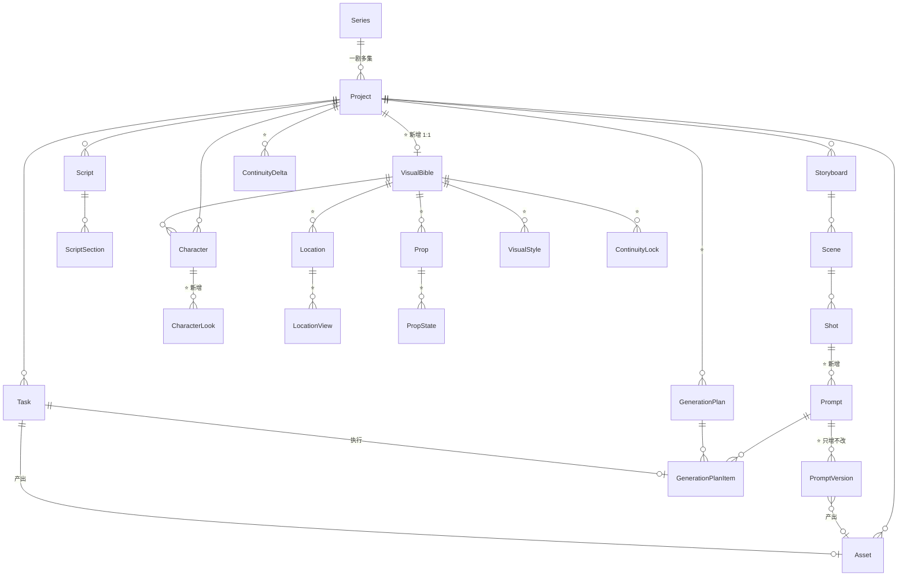
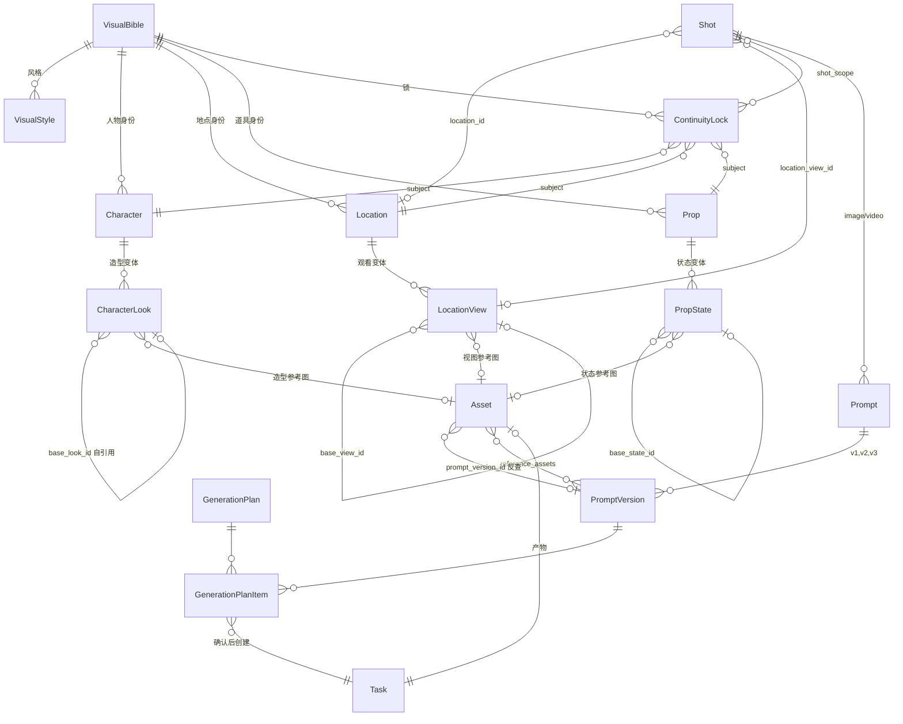

# drama-skills → video-genrate 能力迁移

**交付物：架构分析 · 能力分析 · 差异表 · 数据模型设计 · ER 图 · 实施计划 · 逐 Phase 实施记录**

> 状态：**Phase 1–8 已完成**（Phase 9–12 待做 —— 见 §12 实施计划表）
> 日期：2026-10-04
> 上游仓库：`zenstory-ai/drama-skills` @ `VERSION 0.8.1`（11 个 skill）
> 目标工程：`video-genrate`（AI Video Agent Studio）

> **本文档的读法**：§1–§9 是**设计**（Phase 1–2 产出，保持原样以便对照）；
> **实现与设计的偏差集中在 §8.2 与 §12 的「已完成」备注里**，以那里为准。
> 需要动手改代码前，先看 §12 的当前进度。

---

## 0. 执行摘要

### 0.1 一句话判断

**video-genrate 不需要 drama-skills 的代码，需要它的四套"纪律"：**

| # | 纪律 | 现状差距 |
|---|---|---|
| 1 | **身份 / 变体分离**（Character ≠ Look、Location ≠ View、Prop ≠ State） | 完全没有。角色只有一个 `appearance` 文本 + 一张基准图 |
| 2 | **连续性锁**（把跨镜不变的事实固化成"逐字短语"，强制出现在每条提示词里） | 没有。靠 prompt 里重复描述，无校验 |
| 3 | **Prompt 版本化 + 血缘**（改设定不覆盖旧 Prompt，能反查"这张图是哪个 Prompt 生成的"） | 没有独立 Prompt 实体，`Shot.image_prompt` 是就地覆盖的文本字段 |
| 4 | **Preview → Confirm → Produce**（花钱前先落计划、看预览、显式确认） | 没有。`generate_all_videos` 直接建任务开跑 |

### 0.2 最重要的三个结论

**结论一：video-genrate 的底子比想象的好，是"扩展"不是"重建"。**

- 已有 16 个 ORM 实体、94 个 Skill、14 个 handler、完整 Provider 注册表与三级优先配置。
- `Asset.parent_asset_id` / `Asset.task_id` / `Task.parent_task_id` 已经是血缘雏形。
- `Shot.character_ids` + `Character.reference_asset_id` 已经是"参考图绑定"的雏形（虽然粗糙）。
- 缺的是**"身份/变体"两层建模**、**独立 Prompt 实体**、**计划实体**。

**结论二：drama-skills 有两套并存范式，必须明确选边。**

它内部同时存在：

| 范式 | 落盘 | 状态 |
|---|---|---|
| `creator-first` | 每集 5 份中文 Markdown，**零 JSON** | 现行主线 |
| `structured` | 每阶段 JSONL + 索引 + 清单 | legacy（v0.5 前），现作测试夹具 |

而且 `creator-first` 的 `stage-contract.md` **明确禁止**建立 occurrence / decision 记录，而 `structured` 恰恰以它们为核心——**两者互斥，不可兼得**。

**我们的选择：吸收 `structured` 的数据建模能力 + `creator-first` 的"单一权威 + 只读引用"纪律。**
理由：video-genrate 是**给 Agent 调用的基础设施**，不是给人读的写作台。Agent 需要结构化数据；"五份 Markdown 是唯一真相"是为人设计的约束，直接搬过来会毁掉现有 94 个 Skill 的可用性。但"单一 owner 写、其余只读引用"这条纪律必须学。

**结论三：drama-skills 最值钱的不是 Prompt 模板，是"校验器"。**

它每个 skill 自带 `scripts/*_check.py`（`asset_check.py` / `storyboard_check.py` / `image_prompt_check.py` / `creator_markdown_check.py`），把"创作规则"变成**可机械执行的断言**。其中尤其值得注意的是它的测试哲学（`.agents/notes/.../2026-08-07-tests-prove-behavior-not-prose.md`）：

> **禁止"断言文档包含某字符串"的测试。** 唯一允许的字面扫描方向是**断言被禁字段名不存在**。

它还做过一次**变异测试**：逐个删掉 67 个守卫跑全量测试，**50 个变红、17 个没红**，那 17 个被单独记录在 `test_guards_bite.py` 里。这个手法建议直接搬。

---

## 1. 现有 video-genrate 架构分析

### 1.1 数据模型（16 个实体，单一文件 `backend/app/models.py`，527 行）

**基类与约定**

| 项 | 实现 | 位置 |
|---|---|---|
| Base | `declarative_base()` | `database.py:48` |
| JSON 类型 | `JSONType`：Postgres→JSONB，其它→JSON | `database.py:14` |
| 时间戳 | `TimestampMixin`：`created_at`/`updated_at`（timezone=True, `onupdate=utcnow`） | `models.py:37-41` |
| ID 生成 | `new_id(prefix)` = `{prefix}_{uuid4[:12]}` | `models.py:33` |
| 软删除 | **无**（无 `deleted_at`/`is_deleted`） | — |
| 级联 | 全部靠 `ondelete="CASCADE"` 硬删 | `services/projects.py:258` |

**实体清单**

| 实体 | 表 | 关键字段 | 外键 | 特殊约束 |
|---|---|---|---|---|
| `Series` | `series` | name, style, aspect_ratio, width=1280, height=720, fps=24, episode_duration=300.0, `extra` | — | status idx |
| `Project` | `projects` | series_id, episode_no, style="comic", status, workflow_state, target_duration=300.0, progress, `extra` | series_id→series(SET NULL) | status/workflow_state/series_id idx |
| `Script` | `scripts` | project_id, title, content, outline, version=1, status, provider, `parameters` | project_id→projects | — |
| `ScriptSection` | `script_sections` | project_id, script_id, sequence, code, title, content, target_duration, status, `parameters` | project_id, script_id | `uq(project_id,sequence)` |
| `Storyboard` | `storyboards` | project_id, title, visual_style, scene_count, shot_count, status | project_id | — |
| `Scene` | `scenes` | project_id, storyboard_id, sequence, code, title, **location(String)**, mood | project_id, storyboard_id | — |
| `Shot` | `shots` | **见 1.2** | project_id, scene_id | `uq(scene_id,sequence)` |
| `Character` | `characters` | project_id(**可空**), series_id(**可空**), name, role, description, appearance, personality, voice_style, reference_prompt, negative_prompt, reference_asset_id, `parameters` | project_id, series_id | — |
| `Asset` | `assets` | project_id(**可空**), scene_id/shot_id/character_id(**弱引用无 FK**), type, file_path, url, status, prompt, model, provider, width/height, duration/fps, format, size_bytes, checksum, source, **parent_asset_id**, **task_id** | project_id | type/status/shot_id/task_id idx |
| `Task` | `tasks` | project_id, shot_id, character_id, **parent_task_id**, type, status, progress, priority, payload, result, provider, error, attempts, max_attempts, worker, `logs` | project_id | type/status idx |
| `Workflow` / `WorkflowStep` | `workflows`/`workflow_steps` | state, previous_state, context, history；step 有 state + review_status 分离 | project_id | `uq(workflow_id,step_key)` |
| `AgentLog` | `agent_logs` | actor, event, level, message, detail, duration_ms | project_id, task_id | — |
| `QualityCheck` | `quality_checks` | target_type, target_id, check_key, status, metric, score, run_id | project_id | — |
| `ProviderRecord` | `providers` | id=`kind:name`, kind, enabled, is_default, capabilities, config | — | kind idx |
| `BrowserTask` | `browser_tasks` | target_platform, instruction, steps, status, executor | project_id | — |

### 1.2 Shot 的现状（这是最关键的实体）

```
shots
├── id / project_id / scene_id / sequence / code      定位
├── duration = 5.0                                    时长
├── description / camera                              描述与运镜（自由文本）
├── location                                          ⚠️ 字符串，不是 FK
├── visual_style                                      自由文本
├── character_ids (JSON list)                         ⚠️ 角色名字符串数组，非 FK
├── image_prompt / video_prompt / negative_prompt     ⚠️ 就地覆盖的文本，无版本
├── voice_script / subtitle_text / voice_speaker / voice_instruct
├── status / image_status / video_status / voice_status / subtitle_status
├── image_asset_id / video_asset_id / voice_asset_id
│   / subtitle_asset_id / enhanced_video_asset_id     ⚠️ 弱引用，无 FK
├── retry_count / last_error / quality_score
└── extra (JSON)
uq(scene_id, sequence)
```

**四个结构性问题**（全部需要在本轮演进中解决）：

1. **`location` 是字符串** → 无法挂载 Location/View 的身份与变体。
2. **`character_ids` 是名字数组** → 改名即断链；无法表达"用哪个造型（Look）"。
3. **`image_prompt` 就地覆盖** → 改了设定，旧 Prompt 永久丢失，无法回答"这张图是哪版 Prompt 生成的"。
4. **`*_asset_id` 弱引用** → 由应用层保证一致性，无数据库约束。

### 1.3 数据库与迁移机制

| 项 | 结论 |
|---|---|
| 引擎 | 双支持。`config.py` 默认 Postgres，`.env` 实际用 **SQLite + WAL** |
| pragma | `foreign_keys=ON`、`journal_mode=WAL`、`busy_timeout=15000`（`database.py:32-42`） |
| **Alembic** | **没有**，`requirements.txt` 无依赖 |
| 建表 | `init_db()` → `Base.metadata.create_all()`（`database.py:75-78`），启动时 `main.py:39` 调用 |
| **加列** | `ensure_columns()` + 声明式 `_ADDED_COLUMNS`（`database.py:86-138`），只加不删 |
| 解除 NOT NULL | `ensure_nullable()` + `_DROP_NOT_NULL`（`:141-157`） |
| 补外键 | `ensure_foreign_keys()`（`:160-188`）**仅 Postgres 生效，SQLite 跳过** |

> ⚠️ **这是我们 Migration 方案的关键约束**：项目没有 Alembic，用的是"声明式加列"。新表靠 `create_all` 自动建，**加列必须在 `_ADDED_COLUMNS` 注册**，否则老库不会升级。而 SQLite 下外键约束不会被补——这解释了为什么现在 `Asset.shot_id` 等是弱引用。

### 1.4 分层与调用链

```
Agent ──HTTP──> routers/skills.py ──> skills/base.py (JSON Schema 校验)
                                        │
                     ┌──────────────────┴──────────────────┐
                     │                                     │
             同步 Skill（读/写）                    异步 Skill（生成类）
                     │                                     │
              services/*.py                        services/tasks.create_task()
                     │                                     │
                  SQLAlchemy                        TaskRunner(后台线程池)
                     │                                     │
                    DB                            executors/queue.claim_next()
                                                           │
                                                  executors/handlers.py (14 个)
                                                           │
                                                  providers/registry.get()
                                                           │
                                                  services/assets.ingest_result()
```

**关键机制**

| 机制 | 实现 | 位置 |
|---|---|---|
| Skill 注册 | `@skill()` 装饰器 → `registry` | `skills/base.py:175,172` |
| **Schema 校验** | `Draft202012Validator(self.input_schema)` | `skills/base.py:87,92` |
| 统一返回 | `{ok, status, data, error, error_detail, task_id, elapsed_ms}` | `skills/base.py:52` |
| 队列 | DB 即队列；条件 UPDATE + `rowcount==1` 抢占 | `executors/queue.py:90` |
| 状态机 | `PENDING/RUNNING/SUCCESS/FAILED/CANCELLED/RETRYING` | `core/constants.py:22-31` |
| 重试 | 指数退避 `min(60*2^(attempts-1), 600)` | `executors/queue.py:222` |
| Provider 选择 | `payload > project.extra > .env 全局默认` | `executors/handlers.py` |
| Provider 配置 | **DB `providers` 表 > 环境变量 > 代码默认** | `providers/runtime.py` |
| Workflow 模板 | `{{prompt}}/{{negative_prompt}}/{{width}}/{{height}}/{{seed}}`，整串占位保留 int | `workflows/__init__.py:59,90` |

### 1.5 现有能力盘点：已经有了什么

**已经具备（可直接复用，不要重造）**

- ✅ 项目/剧集/脚本/分镜/场景/镜头 层级
- ✅ 角色 + 基准图 + 多候选 + `set_character_reference`
- ✅ 素材中心 + 血缘雏形（`parent_asset_id`）
- ✅ 任务队列 + 重试 + 断点续跑 + 幂等
- ✅ Provider 注册表 + 三级优先 + 能力声明（`capabilities` JSON）
- ✅ 节点式流水线的回退/审核/重生成
- ✅ 94 个 Skill 的对外契约
- ✅ 参考素材上传（`type=REFERENCE`）

**明确缺失**

- ❌ 视觉设定体系（VisualBible / Location / Prop / Style）
- ❌ 身份与造型分离（Look / View / State）
- ❌ 连续性锁与连续性增量
- ❌ 独立 Prompt 实体与版本
- ❌ 生成计划（Preview/Confirm/Produce）
- ❌ 参考图槽位与用途约束（role / may_control / must_not_control）
- ❌ 自动化测试（**项目零测试**）

---

## 2. drama-skills 能力分析

### 2.1 它的 11 个 skill 与职责

| skill | 职责 | 产出 |
|---|---|---|
| `short-drama` | 主编排、初始化、Dashboard | 路由，**不写创作正文** |
| `short-drama-novel-analyze` | 长篇原著抽样快评、章节索引 | 改编价值评估 |
| `short-drama-develop` | 故事引擎、分集地图 | `creative-brief.md` / `story-engine.md` / `episode-map.jsonl` |
| `short-drama-write` | 单集剧本 | `剧本.md` + 节拍 |
| `short-drama-assets` | **人物/造型、地点/视图、道具/状态、连续性** | `视觉设定.md` |
| `short-drama-image-prompts` | 图片提示词编译 | `图片提示词.md` |
| `short-drama-storyboard` | 镜头与冻结关键帧 | `分镜.md` |
| `short-drama-video-prompts` | 视频/运动/音乐提示词 | `视频提示词.md` |
| `short-drama-produce` | **确认后媒体生产** | 媒体 + 隐藏 job 记录 |
| `short-drama-edit` | 剪辑单与渲染 | `剪辑单.md` |
| `short-drama-review` | 审查（只定位问题，不代改） | `findings.jsonl` / `verdict.json` |

### 2.2 八个可迁移机制（逐个拆解）

---

#### 机制 1：身份 / 变体分离 ⭐⭐⭐⭐⭐

**它怎么做的**

三对实体，结构完全对称：

| 身份（无状态、无有效期） | 变体（有差异 + 有效期 + 原因） |
|---|---|
| `Character` → `identity_anchors[]` / `not_identity[]` | `Look` → `differences{}` / `validity{from,until}` / `base_look_id` |
| `Location` → `spatial_identity{shape,zones,entrances,fixed_anchors,materials}` | `LocationView` → `orientation{}` / `state_differences{dressing,time,weather,light}` |
| `Prop` → `identity_anchors{scale_and_form,materials,function,permanent_marks}` | `PropState` → `condition{}` / `custody{}` / `contents[]` / `text_visibility` |

**判据（原文）**：

> **身份**：换一个就不再是同一个人、地或物。
> **变体**：身份不变，但服装、伤势、时段、天气、开合或持有状态改变。
> **镜头瞬态**：姿势、视线、左右手、站位和相机角度 —— 归分镜。
> **故事语义**：知识、目标、关系 —— 归写作，只引用可见后果。

**为什么好**：它让"换衣服"这件事不再污染角色身份。drama-skills 举的反例很精准：

> ❌ 把「橙色雨衣女人，湿头发，脸上有伤」写成 Character identity
> → 雨衣脱下、头发变干、伤口愈合时，人物就失去所有"身份锚点"

**我们缺什么**：`characters.appearance` 是一个自由文本，`reference_asset_id` 只有一张图。换装 = 改设定 = 换脸。

**迁移策略**：扩展 `characters` 表 + 新增 `character_looks` / `locations` / `location_views` / `props` / `prop_states`。

---

#### 机制 2：连续性锁 ⭐⭐⭐⭐⭐

**它怎么做的**（这是全仓最精妙的设计）

把"跨镜不变的可见事实"固化成一条**逐字短语**，并**强制它出现在所有受影响的提示词正文里**。

**上锁三条件（必须同时成立）**
1. 该事实在本集出现于两个以上镜头（或一个镜头 + 一张资产板）
2. 观众能直接看出前后不一致
3. **它不随剧情改变** —— 会变的是状态，状态不上锁

**语法（原样）**

```
- 连续性锁：LOCK-KNIT《织了一半的毛衣》（镜头：全集；图片提示词项：IMG-PROP-KNIT）· 锁面：pale blue chunky knit wool sweater
```

**锁面的硬规则**
- 只保留最小可辨识名词短语（颜色 + 材质/形制 + 物体）
- 不含标点、动作、状态、数量、镜头信息、剧情
- **不写会随镜头变化的词**（`in her hands` / `half-finished` / `on the sofa`）
- 一个实体一把锁；同一实体的两种造型是两把锁

**校验器抓的两种"假命中"**（非常关键）
1. **粘在词上的匹配不算**：`chipped white enamel mug` 不被 `unchipped white enamel mug` 满足
2. **负面提示词里的匹配不算**：写在 `no`/`not`/`without`/`avoid` 之后的不算在场证据

**数量约束**（`craft_default`）

> 一集里的锁通常是个位数。把每条识别锚点都升级成锁，每条提示词都会被同一串名词短语撑满，反而挤掉本镜真正要执行的动作。

**我们缺什么**：完全没有。现在的做法是每条 prompt 里重复描述，改一处要改 33 处，且无法校验。

**迁移策略**：新增 `continuity_locks` 表 + Prompt Compiler 强制注入 + 校验 Skill。

---

#### 机制 3：连续性增量（≠ 锁！）⭐⭐⭐⭐

**这是最容易被搞混的地方。**

| | 连续性锁 `LOCK-` | 连续性增量 `DELTA-` |
|---|---|---|
| 回答什么 | "什么永远不变" | "什么变了、从什么变成什么、为什么" |
| 粒度 | 最小名词短语 | before / after / cause / 有效期 / 影响范围 |
| 什么时候用 | 跨镜一致 | 剧情导致的状态变化 |

**"未知"不等于"恢复默认"**（原文）

> 上集带伤、本集没提，不能自动恢复为无伤 —— 保留最后确认状态并建 `unresolved`。

**三条关键判据**
1. **知道事实 ≠ 知道对方也知道**（区分"甲知道/乙知道/甲知道乙知道"）
2. **有来源 ≠ 变化合理**（"灯闪了一下"不足以解释整栋楼永久断电）
3. **未来工作只描述不预建**（`affected_binding_locators` 用 `future_until_shots_exist`）

**迁移策略**：新增 `continuity_deltas` 表，与 `continuity_locks` 分开建。**不要合并成一个概念。**

---

#### 机制 4：Prompt 版本化 + 血缘 ⭐⭐⭐⭐⭐

**它怎么做的**

`Prompt` 是逻辑单元，每次编译产生一个**新版本**，**永不覆盖**：

```
prompts (逻辑单元)
  └── prompt_versions (v1, v2, v3...)
        ├── compiled_from   ← 编译输入快照（哪些 VB 条目、什么版本）
        ├── recipe          ← {renderer, version}
        ├── reference_assets ← 参考图槽位绑定
        └── status          ← DRAFT/READY/STALE/SUPERSEDED
```

**"staleness" 是核心价值**：改了角色设定后，旧 Prompt 能被识别为 `STALE`（因为 `compiled_from` 记录的输入版本变了），从而知道"哪些镜头需要重新出图"。

drama-skills 在 Markdown 轨道靠 `.short-drama/state.json` 的 `artifacts[*].inputs{path→sha256}` 实现新鲜度判定；在 structured 轨道靠 `source_refs` + 版本。

**它同时明确了一条反直觉的纪律**（ADR `2026-08-18`）：

> **产物文件里不写哈希。** 哈希只在工具自维护层（运行期 state）里。golden-project README 原文：
> "引用只声明上游产物的归属与路径，不带字节摘要；产物是否仍是被接受的那一版由项目状态判定，**不由文件里的哈希判定**。"

原因（CHANGELOG 0.4.2）：他们全仓清点时发现"331 个手填哈希已全部与字节对不上"。**结论：手工维护的哈希必然腐烂。**

**迁移策略**：新增 `prompts` + `prompt_versions`；`compiled_from` 存**实体 id + 版本号**（不是哈希）；`stale` 判定放在 service 层动态计算。

---

#### 机制 5：Preview → Confirm → Produce ⭐⭐⭐⭐⭐

**它怎么做的**（四步硬闸门，顺序不可合并）

1. **建立有边界的 job**：一种 modality、明确数量、完整 prompt、参考文件、参数、输出路径、adapter profile
2. **`prepare`** → 返回完整预览，**任一漂移 fail closed**
3. **等创作者在看到预览之后明确确认** → 只有明确同意**这项当前任务**才算
   > "继续"、"都做完"、"预算没问题"、上游内容已接受、之前确认过另一版，**都不算**
4. **`run`** → 启动 adapter 前**消费一次确认**；成功或失败后再次执行都必须重新确认

**Job、prompt、参数、输出路径或输入任一变化 → 旧确认立即失效。**

**指纹绑定**：`fingerprint = sha256(canonical(execution))`；确认短语是 `CONFIRM <job_id> <fingerprint[:12]>`；篡改 stored job 但保留旧指纹 → 报错。

**中断成本保护**（这条非常实用）

> 视频任务在**提交那一刻**就已经计费，不是在拿到结果时。
> adapter 拿到供应商任务 ID 的第一时间就写进 `handle_path`（早于第一次轮询）。
> 中断后：`audit` 报 `orphaned_provider_job` → `collect` 用那个 ID 免费取回 → **只有在 collect 也确认失败后才重新确认与重投**。
> ⚠️ **不要在 audit 报 orphaned 时直接重投 —— 那是为同一个镜头付第二次钱。**

**迁移策略**：新增 `generation_plans` + `generation_plan_items`；确认走 `fingerprint`；`collect` 概念可映射到现有 `Task` 体系（我们已有 `Task.result` 可存 provider job id）。

---

#### 机制 6：参考图槽位与用途约束 ⭐⭐⭐⭐

**它怎么做的**

三种记号，含义完全不同，**不得混用**：

| 记号 | 含义 | 能否作生产输入 |
|---|---|---|
| `IMG-...` | 《图片提示词.md》的**提示词条目 ID** | 可（作为 job 来源） |
| `REF-...` | **项目内真实存在**的参考图片 | ✅ 可以 |
| `PLAN-...` | 创作者**项目外自备**、生成时自行挂载 | ❌ **不行**，`prepare` 直接失败 |

**槽位语法**

```
REF-<slot>（顺序：<n>）· <项目相对路径>《<中文名称>》（用途：<用途>；控制：<范围>；不得控制：<范围>）
```

**用途是封闭词表（9 个）**：`身份 / 造型状态 / 地理 / 构图 / 尺度 / 效果 / 起始帧 / 结束帧 / 风格`

**关键判据（原文）**

> `身份` 和 `造型状态` 的界线是「本集之内会不会变」，不是「算不算衣服」。

**为什么需要 `must_not_control`**：防止"一张图越权决定服装/构图/文字"。它举的例子：身份参考不自动决定姿势/构图/临时造型。

**迁移策略**：新增 `reference_bindings` 表，或先落在 `prompt_versions.reference_assets` 的 JSON 里（推荐后者起步，见 §4.4）。

---

#### 机制 7：规则分级 ⭐⭐⭐⭐

**四级规则**（这是它处理"什么该硬、什么该软"的方案）

| 级别 | 谁能判定 | 能否阻断 |
|---|---|---|
| `structural_invariant` | 本地校验器可证明 | ✅ 阻断 |
| `reviewed_invariant` | 需语义判断（reviewer） | ✅ 可阻断 |
| `craft_default` | 常用做法 | ❌ 可覆盖 |
| `taste_option` | 创作者选择 | ❌ 不作缺陷 |

**ADR `2026-07-16` 记录的关键取舍**：

> 三次否决"用关键词/正则匹配创作语义" —— "把上下文判断变成脆弱规则"。
> 曾把 `masterpiece|8k|uhd` 编译成错误；曾试图用固定质量词表阻断交付 —— 全部撤销。

**迁移策略**：我们的校验 Skill 也按此分级；`craft_default` 一律不阻断。

---

#### 机制 8：镜头修订的身份守恒 ⭐⭐⭐⭐

**它怎么做的**

> 镜头 ID 表示**同一个导演决定的连续身份**，不等于列表位置，也不等于外部制作任务编号。

| 操作 | ID 规则 |
|---|---|
| 重排 | **保留原 ID** |
| 插入 | **创建新 ID**，不给后续镜头重编号 |
| 内容修订 | **保留 ID** |
| 拆分 | 停用旧 ID，为每个新镜头创建新 ID，**不把旧 ID 偷给子镜头** |
| 合并 | 停用全部旧 ID，创建新 ID |

配合 `revision_lineage` 片段记录前身/停用/原因。

**迁移策略**：`Shot.code` 已经是稳定 code（如 `03`）。需**补一条纪律**：禁止重编号，新增用新 code；并在 `Shot.extra` 里记 `revision_lineage`。

---

### 2.3 六张形态卡（Style 体系的实现方式）

drama-skills 的 Style **不是风格名前缀**，而是"改变必须出现/可以省略的字段"。

六张卡：`实拍 / 国漫二次元 / 二维动态漫 / Q版表达 / 风格化三维 / 水墨笔触`

每张卡统一 9 节：`叙事职责 / 身份锚点载体 / 连续性载体 / 层级拆分 / 光与材质词汇 / 运动预算 / 声音与文字职责 / 跨阶段传递 / 常见失效`

**它的判据句**（值得抄）

> **它改变了哪一个字段的写法 —— 若把它删掉，提示词一字不变，那它就只是标签。**

**四层结构（跨形态通用）**：`身份层 / 环境层 / 可动层 / 效果层`

**迁移策略**：`visual_styles` 表存 `form_card` 枚举 + 上述九项；形态卡内容作为**种子数据**内置，不是硬编码逻辑。

---

## 3. 差异表

| # | 能力 | drama-skills | video-genrate 现状 | 差距 | 迁移策略 | 优先级 |
|---|---|---|---|---|---|---|
| 1 | VisualBible | `视觉设定.md`（单一权威） | 无 | **完全缺失** | 新增 `visual_bibles` | P0 |
| 2 | Character 身份锚点 | `identity_anchors[]` + `not_identity[]` | `appearance` 自由文本 | 缺失 | **扩展** `characters` | P0 |
| 3 | Look 造型变体 | `LOOK-*` + `differences` + `validity` | 无（换装=改设定） | **完全缺失** | 新增 `character_looks` | P0 |
| 4 | Location / View | `LOC-*` + `VIEW-*` | `Shot.location` 字符串 | **完全缺失** | 新增 `locations` / `location_views` | P0 |
| 5 | Prop / State | `PROP-*` + `PSTATE-*` | 无 | **完全缺失** | 新增 `props` / `prop_states` | P1 |
| 6 | Style | 六形态卡 + 9 字段 | `Project.style` 字符串 | **完全缺失** | 新增 `visual_styles` | P1 |
| 7 | **连续性锁** | `LOCK-*` 锁面逐字强制 | 无 | **完全缺失** | 新增 `continuity_locks` + 注入 | **P0** |
| 8 | 连续性增量 | `DELTA-*` before/after/cause | 无 | **完全缺失** | 新增 `continuity_deltas` | P1 |
| 9 | **Prompt 版本** | 独立 spec + `derivation` | `Shot.image_prompt` 就地覆盖 | **结构性缺陷** | 新增 `prompts`/`prompt_versions` | **P0** |
| 10 | **血缘可反查** | `source_refs` + state.json | `Asset.parent_asset_id`（弱） | 部分 | 扩展 `assets` + `prompt_version_id` | **P0** |
| 11 | 参考图槽位 | `REF-`/`PLAN-`/`IMG-` + 用途 + 控制边界 | `character_ids` + 单张基准图 | 粗糙 | 扩展 `assets` + `reference_bindings` | P1 |
| 12 | **Preview/Confirm** | 四步硬闸门 + 指纹 | 直接建任务 | **完全缺失** | 新增 `generation_plans` | **P0** |
| 13 | Prompt Compiler | 八段式配方 | 无（prompt 手写） | **完全缺失** | 新增 Compiler service | **P0** |
| 14 | 4K 生图 | 由 adapter profile 声明 | `.env` 固定 1280×720 | 配置层 | Prompt/Plan 支持 resolution | P1 |
| 15 | 规则分级 | 四级 | 无 | 缺失 | 校验 Skill 分级 | P2 |
| 16 | 单一 owner 写 | 严格 | 无 | 缺失 | 纪律 + 校验 | P2 |
| 17 | **自动化测试** | 30 个测试文件 + 变异测试 | **零测试** | **完全缺失** | 引入 pytest | **P0** |
| 18 | 镜头身份守恒 | `revision_lineage` | `Shot.code` 稳定，无规则 | 缺失 | 纪律 + `extra` | P2 |
| 19 | Provider 能力声明 | `capabilities` + role 词表 | `ProviderRecord.capabilities` 已有 | 部分 | **扩展即可** | P2 |
| 20 | 审查机制 | `findings` + `verdict` | `QualityCheck`（自动质检） | 需增强 | 扩展 `quality_checks` | P2 |

---

## 4. 数据模型设计

### 4.1 设计原则（四条，不可违背）

1. **能扩展就不新建** —— `characters` / `assets` / `shots` / `quality_checks` 一律加列，不建平行表
2. **新表必须挂 `project_id`** —— 与现有 16 个实体保持一致，便于级联删除
3. **血缘用 id 不用哈希** —— `compiled_from` 存实体 id + 版本号；手工哈希必然腐烂（drama-skills 的教训）
4. **Prompt 只增不改** —— `prompt_versions` 永不 UPDATE 覆盖，只 INSERT

### 4.2 新增实体（10 个）

#### (1) `visual_bibles` —— 视觉设定总纲

```
visual_bibles
├── id                 String(40) PK
├── project_id         FK projects.id CASCADE   ⚠️ UNIQUE（一项目一圣经）
├── series_id          FK series.id SET NULL    （可选，系列级复用）
├── title              String(200)
├── visual_logline     Text                     视觉一句话
├── current_style_id   FK visual_styles.id      （当前生效风格）
├── era_anchors        JSON                     时代锚点
├── global_rules       JSON                     全局视觉规则
│     {lighting, palette, camera_language, composition, negative}
├── text_policy        JSON                     全局文字政策
├── status             String(20)  DRAFT/ACTIVE/LOCKED
├── version            Integer     默认 1
└── created_at / updated_at
索引：project_id(unique), series_id, status
```

#### (2) `visual_styles` —— 视觉风格 / 形态

```
visual_styles
├── id                 String(40) PK
├── project_id         FK projects.id CASCADE
├── bible_id           FK visual_bibles.id CASCADE, index
├── name               String(200)
├── form_card          String(40)   live_action/guoman_2d/dynamic_comic/
│                                   chibi/stylized_3d/ink_wash
├── narrative_duty     Text         叙事职责
├── identity_carrier   JSON         身份锚点载体
├── continuity_carriers JSON        逐镜必带的连续性字段
├── layer_split        JSON         层级拆分（身份/环境/可动/效果）
├── rendering          JSON         材质与光色词汇
├── lighting           JSON
├── palette            JSON
├── camera_language    JSON
├── composition_rules  JSON
├── motion_budget      JSON         运动预算
├── negative_rules     JSON
├── is_current         Boolean      默认 false
├── status             String(20)   DRAFT/ACCEPTED
├── version            Integer
└── created_at / updated_at
索引：project_id, bible_id, form_card
```

#### (3) `character_looks` —— 角色造型变体

```
character_looks
├── id                 String(40) PK
├── project_id         FK projects.id CASCADE
├── character_id       FK characters.id CASCADE, index
├── code               String(60)   如 LOOK-LINYE-RAIN
├── name               String(200)
├── base_look_id       FK character_looks.id SET NULL（变体的基底，自引用）
├── differences        JSON         {wardrobe_layers[], hair_styling[],
│                                    makeup[], injury[], weathering[]}
├── cause_shot_id      FK shots.id SET NULL   变化原因
├── valid_from         String(80)   如 EP003/SC004
├── valid_until        String(80)   可空，或 'open_ended'
├── reference_asset_id FK assets.id SET NULL  造型参考图
├── is_current         Boolean
├── status             String(20)
└── created_at / updated_at
约束：uq(character_id, code)
```

#### (4) `locations` / (5) `location_views`

```
locations
├── id                 String(40) PK
├── project_id         FK projects.id CASCADE
├── series_id          FK series.id SET NULL
├── bible_id           FK visual_bibles.id SET NULL
├── code               String(60)   LOC-FERRY-OFFICE
├── name / display_name
├── description        Text
├── spatial_identity   JSON         {shape, zones[],
│                                    entrances[{id, connects_to}],
│                                    fixed_anchors[], materials[]}
├── era_form           JSON         时代形制
├── not_identity       JSON
├── reference_asset_id FK assets.id SET NULL
├── status / version / created_at / updated_at
约束：uq(project_id, code)

location_views
├── id                 String(40) PK
├── project_id         FK projects.id CASCADE
├── location_id        FK locations.id CASCADE, index
├── code               String(60)   VIEW-FERRY-OFFICE-NORTH-NIGHT
├── name               String(200)
├── base_view_id       FK location_views.id SET NULL（自引用）
├── orientation        JSON         {from_zone, toward,
│                                    visible_fixed_anchors[]}
├── state_differences  JSON         {dressing[], time, weather, light[]}
├── cause_shot_id      FK shots.id SET NULL
├── valid_from / valid_until
├── reference_asset_id FK assets.id SET NULL
├── is_current         Boolean
└── created_at / updated_at
约束：uq(location_id, code)
```

#### (6) `props` / (7) `prop_states`

```
props
├── id                 String(40) PK
├── project_id / series_id / bible_id
├── code               String(60)   PROP-TIN-CASE
├── name / display_name
├── identity_anchors   JSON         {scale_and_form, materials[],
│                                    function, permanent_marks[]}
├── text_policy        JSON         {mode: exact_readable|graphic_only|
│                                    no_readable_text|pending_creator_text,
│                                    text, placement}
├── not_identity       JSON
├── reference_asset_id FK assets.id SET NULL
└── status / version / created_at / updated_at
约束：uq(project_id, code)

prop_states
├── id                 String(40) PK
├── project_id         FK
├── prop_id            FK props.id CASCADE, index
├── code               String(60)   PSTATE-TIN-OPEN-EMPTY
├── base_state_id      FK prop_states.id SET NULL
├── condition          JSON         {open, damage, powered} 或 {summary}
├── custody            JSON         {owner_id, holder_id, hand, location_id}
├── contents           JSON         [prop_id, ...]  内容物
├── text_visibility    String(60)
├── cause_shot_id      FK shots.id SET NULL
├── valid_from / valid_until
├── is_current         Boolean
└── created_at / updated_at
约束：uq(prop_id, code)
```

#### (8) `continuity_locks` —— 连续性锁

```
continuity_locks
├── id                 String(40) PK
├── project_id         FK projects.id CASCADE
├── bible_id           FK visual_bibles.id SET NULL, index
├── code               String(80)   LOCK-KNIT
├── name               String(200)  中文名
├── surface            Text         ⭐ 锁面（逐字名词短语）
├── prompt_language    String(10)   默认 'en'
├── subject_type       String(20)   character/location/prop/style
├── subject_id         String(40)   ⚠️ 弱引用（指向具体实体）
├── variant_id         String(40)   可空，指向 look/view/state
├── shot_scope         JSON         ["all"] 或 ["shot_id1", ...]
├── prompt_scope       JSON         可空，图片提示词条目 code 列表
├── status             String(20)   ACTIVE / RELEASED
├── version            Integer
└── created_at / updated_at
约束：uq(project_id, code)
索引：project_id, subject_type+subject_id
```

> **`surface` 是这张表的灵魂**：它必须逐字出现在所有 in-scope 的 Prompt 正文里。
> 校验规则：大小写不敏感、换行按空格、**整词匹配**（不能粘在别的词上）、**排除负面提示词**。

#### (9) `continuity_deltas` —— 连续性增量

```
continuity_deltas
├── id                 String(40) PK
├── project_id         FK projects.id CASCADE
├── code               String(80)   DELTA-TIN-OPEN
├── scene_id           FK scenes.id SET NULL
├── shot_id            FK shots.id SET NULL
├── subject_type       String(20)
├── subject_id         String(40)
├── state_field        String(80)   如 condition.open / custody
├── before             JSON         {value, state_id?}
├── after              JSON         {value, state_id?}
├── cause_shot_id      FK shots.id SET NULL
├── effective_from     String(80)
├── effective_until    String(80)   可空
├── next_linked_shot_id FK shots.id SET NULL   CON-01 边界核对
├── reconciliation_status String(30) must_match_or_revise / resolved
├── affected_refs      JSON         受影响的下游 id 列表
├── status             String(20)
└── created_at / updated_at
```

#### (10) `prompts` / `prompt_versions` —— Prompt 与版本 ⭐

```
prompts  ← 逻辑单元（一个镜头一类产物一条）
├── id                 String(40) PK
├── project_id         FK projects.id CASCADE, index
├── shot_id            FK shots.id CASCADE, index（可为空的语音/音乐级）
├── type               String(20)   image / video / voice / music
├── code               String(80)   IMG-... / MOTION-...
├── name               String(200)
├── current_version_id FK prompt_versions.id SET NULL
├── latest_version     Integer      默认 0
└── created_at / updated_at
约束：uq(project_id, code)

prompt_versions  ← 只 INSERT，永不 UPDATE ⭐
├── id                 String(40) PK
├── prompt_id          FK prompts.id CASCADE, index
├── version            Integer
├── raw_prompt         Text         上游原文（Agent 手写）
├── compiled_prompt    Text         ⭐ Compiler 产出的可复制正文
├── negative_prompt    Text
├── compiled_from      JSON         ⭐ 编译输入快照
│     {bible:{id,version}, style:{id,version},
│      subjects:[{kind,id,version}],
│      locks:[{id,version,surface}],
│      shot:{id,updated_at}, bindings:[...]}
├── recipe             JSON         {renderer:'video-genrate-8seg', version:'1.0.0'}
├── model              String(100)
├── provider           String(40)
├── width / height / aspect_ratio / resolution
├── parameters         JSON
├── reference_assets   JSON         [{slot, order, asset_id|plan_locator,
│                                     kind:REF|PLAN|IMG, role, label,
│                                     may_control[], must_not_control[],
│                                     admission_status}]
├── continuity_lock_ids JSON
├── status             String(20)   DRAFT/READY/STALE/SUPERSEDED/APPROVED
├── stale_reason       Text
├── created_by         String(40)
└── created_at
约束：uq(prompt_id, version)
索引：prompt_id, status
```

> **`STALE` 的判定是动态的**：Compiler 重跑时对比 `compiled_from` 里记录的实体版本 vs 当前版本，不一致 → 标记 STALE 并写明 `stale_reason`。**不改旧记录**，只在需要时生成新版本。

#### (11) `generation_plans` / `generation_plan_items` —— 生成计划 ⭐

```
generation_plans
├── id                 String(40) PK
├── project_id         FK projects.id CASCADE, index
├── name               String(200)
├── plan_type          String(30)   batch_image/batch_video/batch_voice/mixed
├── source_scope       JSON         选中范围（shot codes / stage / 筛选条件）
├── parameters         JSON         全局默认参数
├── summary            JSON         ⭐ 预览汇总
│     {item_count, by_modality:{}, by_provider:{},
│      resolutions:{}, est_seconds, est_cost_note, warnings[]}
├── fingerprint        String(64)   ⭐ 内容指纹，确认绑定
├── status             String(20)   DRAFT/PREVIEWED/CONFIRMED/RUNNING/
│                                   DONE/CANCELLED/EXPIRED
├── confirmed_at / confirmed_by
├── expires_at
├── task_ids           JSON         确认后创建的任务
└── created_at / updated_at

generation_plan_items
├── id                 String(40) PK
├── plan_id            FK generation_plans.id CASCADE, index
├── ordinal            Integer
├── shot_id            FK shots.id SET NULL, index
├── prompt_version_id  FK prompt_versions.id SET NULL
├── modality           String(20)   image/video/voice/music
├── provider / model
├── width / height / aspect_ratio / resolution
├── parameters         JSON
├── reference_assets   JSON
├── predicted_cost     JSON
├── status             String(20)   PENDING/TASK_CREATED/SKIPPED/FAILED
├── task_id            FK tasks.id SET NULL
└── created_at / updated_at
约束：uq(plan_id, ordinal)
```

> **`fingerprint`**：对 `(items + parameters + outputs)` 做 canonical JSON + sha256。
> 确认时记录，`Produce` 时校验；任一变化 → 旧确认失效，需重新预览。

### 4.3 扩展实体（加列，不新建表）

#### `characters` 加 6 列

| 列 | 类型 | 说明 |
|---|---|---|
| `bible_id` | FK visual_bibles.id SET NULL | 归属视觉设定 |
| `code` | String(60) | 稳定代号（如 `CHAR-LINYE`），uq(project_id, code) |
| `identity_anchors` | JSON | 持久识别锚点，如 `["方额窄下颌","后颈发际收成尖角"]` |
| `not_identity` | JSON | 明确不算身份的，如 `["单场雨水","瞬时表情"]` |
| `persistent_performance_facts` | JSON | 持续表演事实 |
| `voice_direction` | JSON | 声音方向（参考/判据/区分度/专名发音/非身份项） |

> 保留 `appearance` / `personality` / `reference_prompt` / `reference_asset_id` 不动 —— 向后兼容。

#### `shots` 加 11 列

| 列 | 类型 | 说明 |
|---|---|---|
| `location_id` | FK locations.id SET NULL, index | ⭐ 替代字符串 `location` |
| `location_view_id` | FK location_views.id SET NULL | 机位视图 |
| `visual_basis` | JSON | 视觉依据（引用 VB 条目 id + 结论） |
| `asset_bindings` | JSON | `[{kind,id,variant_id,role}]` |
| `continuity_lock_ids` | JSON | 生效的锁 |
| `continuity_delta_ids` | JSON | 相关的增量 |
| `start_boundary` | JSON | 起始边界六分量 |
| `end_boundary` | JSON | 结束边界六分量 |
| `primary_transition` | JSON | `{trigger, action, result}` |
| `framing` | JSON | `{size, angle, camera_height, aspect_notes}` |
| `coverage_role` | String(30) | `primary` / `intentional_repeat` |

> **旧字段一律降级为「单向兼容投影」**（见附录 B 裁定）：
> `location`(String) / `image_prompt` / `video_prompt` / `negative_prompt` / `character_ids`
> 由 Compiler **只写不读**地回写一份，让未迁移的 94 个 Skill 继续能跑；
> **新逻辑一律以 `location_id` / `asset_bindings` / `prompts`+`prompt_versions` 为准**。

#### `assets` 加 7 列

| 列 | 类型 | 说明 |
|---|---|---|
| `prompt_version_id` | FK prompt_versions.id SET NULL, index | ⭐ "这张图是哪个 Prompt 版本生成的" |
| `generation_plan_item_id` | FK generation_plan_items.id SET NULL | 出自哪个计划项 |
| `role` | String(40) | `reference`/`reference_candidate`/`keyframe`/`final` |
| `subject_type` | String(20) | character/location/prop/shot |
| `subject_id` | String(40) | 服务的实体 |
| `variant_id` | String(40) | 对应的 look/view/state |
| `provenance` | JSON | 血缘快照（冗余但查询友好） |

> 已有 `parent_asset_id` / `task_id` / `checksum` / `source` 继续用。

#### `quality_checks` 加 2 列（可选，P2）

`rule_tier`（`structural_invariant`/`reviewed_invariant`/`craft_default`/`taste_option`）、`rule_id`（如 `CON-07`）

### 4.4 明确**不**新增的东西（防止过度设计）

| 不做 | 理由 |
|---|---|
| ❌ 独立的 `reference_bindings` 表 | 起步阶段落在 `prompt_versions.reference_assets` JSON 里足够；等需要跨 Prompt 查询"哪些图被谁引用"时再抽表 |
| ❌ `personas` / `decision_records` 表 | drama-skills 需要是因为它给人用；我们 Agent 调用的决策过程已在 `agent_logs` 里 |
| ❌ 哈希列（`content_hash` 等） | drama-skills 血的教训：手工哈希 331 个全部腐烂 |
| ❌ 平行的一套 `vb_*` 表替代现有实体 | 违反"能扩展就不新建" |
| ❌ Alembic 迁移框架 | 现有 `_ADDED_COLUMNS` 机制够用；引入 Alembic 需重构建表流程，风险大于收益 |
| ❌ 把 `Character` 拆成 `VBCharacter` | 现有 `characters` 表已有 `project_id`/`series_id`/`reference_asset_id`，加列即可 |

---

## 5. ER 图

### 5.1 现有实体改造后（主干）



### 5.2 新增部分详图（身份 / 变体对称结构）



### 5.3 血缘反查链路（用户要求的最高优先级能力）

从一张最终图片反查完整链路：

```
Asset (图片)
  ├─ prompt_version_id ──> PromptVersion
  │     ├─ compiled_from ──> VisualBible(id+version)
  │     │                      VisualStyle(id+version)
  │     │                      Character(id+version) + CharacterLook
  │     │                      Location + LocationView
  │     │                      Prop + PropState
  │     │                      ContinuityLock(id+version, surface)
  │     ├─ reference_assets ──> Asset (参考图) ──> 再往上反查
  │     ├─ model / provider / parameters / resolution
  │     └─ recipe {renderer, version}
  ├─ prompt_id ──> Prompt ──> shot_id ──> Shot ──> Scene ──> Storyboard
  │                                                   └─> Project ──> Series
  ├─ shot_id ──> Shot ──> source_refs ──> ScriptSection / Script
  ├─ task_id ──> Task ──> payload / provider / attempts
  ├─ generation_plan_item_id ──> GenerationPlanItem ──> GenerationPlan
  └─ parent_asset_id ──> Asset (上一版)
```

**一句话**：任何一张图，都能回答"哪个项目 / 哪个剧本段 / 哪个镜头 / 哪个角色 / 哪个造型 / 哪版 Prompt / 哪个模型 / 哪些参考图 / 哪次任务"。

---

## 6. Prompt Compiler 设计

### 6.1 输入装配

```
                    ┌──────────────────┐
                    │   Visual Bible   │ era_anchors / global_rules / text_policy
                    └────────┬─────────┘
                             │
     ┌───────────────────────┼───────────────────────┐
     ▼                       ▼                       ▼
 VisualStyle           Character+Look          Location+View
 (form_card/           (identity_anchors +     (spatial_identity +
  rendering/            differences +           orientation +
  motion_budget)        validity)               state_differences)
     │                       │                       │
     └───────────────────────┼───────────────────────┘
                             ▼
                         Prop+State
                    (identity_anchors + condition)
                             │
                             ▼
                    ┌──────────────────┐
                    │  ContinuityLock  │ surface（逐字强制）
                    └────────┬─────────┘
                             ▼
                    ┌──────────────────┐
                    │      Shot        │ framing / boundaries / transition
                    └────────┬─────────┘    / visual_basis
                             ▼
                    ┌──────────────────┐
                    │ Reference Assets │ 槽位/顺序/role/may_control
                    └────────┬─────────┘    /must_not_control
                             ▼
                    ╔══════════════════╗
                    ║ Prompt Compiler  ║
                    ╚════════╤═════════╝
                             ▼
                    PromptVersion
                    {compiled_prompt, negative_prompt,
                     compiled_from, recipe, reference_assets}
```

### 6.2 编译顺序（八段式，源自 `common-recipe.md`）

| # | 段 | 来源 | 规则 |
|---|---|---|---|
| 1 | **用途与主体** | Prompt.type + Shot.purpose | 先写"这是人物设定图 / 场景空镜 / 道具参考 / 局部修改"，再写主体 |
| 2 | **稳定锚点** | Character.identity_anchors / Location.spatial_identity / Prop.identity_anchors | 写可见、可比较的内容 |
| 3 | **版本差异** | Look.differences / View.state_differences / State.condition | 只写相对基准的变化 + 当前状态 |
| 4 | **构图与尺度** | Shot.framing + 参考图 role=构图/尺度 | 视角、画幅、主体占比、相对位置 |
| 5 | **材质、色彩与光线** | VisualStyle.rendering/lighting/palette + View.light | 表面、主次色关系、光向 |
| 6 | **背景 / 舞台政策** | VisualStyle + View.dressing | 干净背景 / 环境内展示 / empty_stage |
| 7 | **文字与功能** | Prop.text_policy → 呈现方法 | 两层映射（见下） |
| 8 | **排除与保留** | VisualStyle.negative_rules + Shot 排除项 | **只写当前最可能的误读**，不做成段否定罗列 |

**⭐ 连续性锁单独成一条强制注入步骤**（在 2–5 段之后）：

```
对每一条 in-scope 的 ContinuityLock：
  断言 surface 逐字出现在 compiled_prompt 中
  缺失 → 编译失败（structural_invariant，不是警告）
```

**文字政策两层映射**（结构强制，源自 drama-skills 校验器）

| 资产来源政策 | 允许的呈现方法 |
|---|---|
| `exact_readable` | `readable`（须给精确文字）或 `postproduction` |
| `graphic_only` | `symbolic` |
| `no_readable_text` | `blank` 或不可读的 `symbolic` |
| `pending_creator_text` | `postproduction` |

> ⚠️ `readable` 与"全局无文字约束"**不能共存** → 编译期报错。

**正文卫生规则**（照搬 `image_prompt_check.py` 的强制项）

编译产出的 `compiled_prompt` 中**禁止出现**：
- 64 位十六进制哈希或 `<sha256>`
- 引擎专用语法：`--ar` / `--v` / `--q` / `--niji` / `--style` / `--no` / `--seed` / `--cref` / `--sref` / `::-数字` / `:(0|1).数字)`
- JSON 键名、字段路径、规则 ID（`CON-07`）、状态词
- 文件路径、绝对路径、盘符
- 流程说明、"请模型务必"、重试历史

### 6.3 版本与 stale

```python
# 伪代码：编译即新版本，永不覆盖
def compile_image_prompt(shot_id, options) -> PromptVersion:
    inputs = assemble_inputs(shot_id)          # 装配 §6.1 全部素材
    if not inputs.complete:
        raise IncompleteInputsError(...)        # 缺身份 → 停在提案，不出 prompt

    compiled = render_8segments(inputs)         # §6.2 八段式
    compiled = inject_locks(compiled, inputs.locks)   # 强制注锁（失败即抛）
    validate_hygiene(compiled)                  # 正文卫生
    validate_text_policy(inputs)                # 文字政策两层映射

    prompt = get_or_create_prompt(shot_id, type)
    version = prompt.latest_version + 1
    return insert_prompt_version(               # INSERT，不 UPDATE
        prompt, version,
        compiled_prompt=compiled,
        compiled_from=snapshot_versions(inputs),  # 实体 id + version，不是哈希
        reference_assets=inputs.bindings,
        continuity_lock_ids=[l.id for l in inputs.locks],
    )
```

**STALE 判定**（`check_prompt_staleness(prompt_id)`）：

```
对 compiled_from 里每个实体：
    当前 version != 快照 version  →  STALE
    实体已被删除                  →  STALE
    ContinuityLock.surface 变了   →  STALE（锁面变了等于脸变了）
```

返回 `{stale: bool, reasons: [...]}`，供 Agent 决定"哪些镜头需要重出"。

---

## 7. 状态机

### 7.1 PLAN / REF / IMG 三态（映射到我们的 Asset）

| 态 | 语义 | 我们怎么表达 |
|---|---|---|
| **PLAN** | 计划要生成但**还不存在**的资产 | `GenerationPlanItem.status = PENDING`（不产生 Asset 行） |
| **REF** | 已存在且**已验证**、可作参考输入的资产 | `Asset.role = "reference"` + `Asset.status = READY` + `reference_assets[].kind = "REF"` |
| **IMG** | 真正已生成的图片资产 | `Asset.type = "image"` + `role = "keyframe"/"final"` |

**关键纪律**（照搬）
- PLAN- 状态**不能作生产输入**：引用一个 `PENDING` 的 plan item 去生成 → 校验层直接失败
- 生成完成 → 文件落盘 → 写入 Asset → **才能被绑成 REF** 供下游使用
- **生产不自动回填**：新材料不会自动改变已有 Shot 的绑定，需显式操作

### 7.2 Preview → Confirm → Produce

```
Agent: create_generation_plan(scope, params)
         │
         ▼  status=DRAFT
       plan 记录（含 items）
         │
Agent: preview_generation_plan(plan_id)
         │
         ▼  校验：prompt 是否 READY？参考图是否存在？provider 能力是否支持？
             ┌─ 有问题 → status=PREVIEWED + warnings[]（不阻断，供 Agent 判断）
         ▼  status=PREVIEWED
         + fingerprint = sha256(canonical(items+params+outputs))
         + summary = {数量/模态分布/provider/分辨率/预估}
         │
Agent: 展示给用户 → 用户确认
         │
Agent: confirm_generation_plan(plan_id, fingerprint)
         │
         ▼  校验 fingerprint 与当前一致（不一致 → 失败，要求重新预览）
         ▼  status=CONFIRMED
         + confirmed_at / expires_at
         │
Agent: (物化) → 创建 Task，逐项回写 item.status=TASK_CREATED, item.task_id
         ▼  status=RUNNING → DONE
```

**必须遵守的三条**
1. **指纹绑定**：plan 任一字段变化 → 旧确认失效
2. **一次性消费**：确认只能用于一次物化
3. **预估不承诺**：`summary.est_cost_note` 只描述口径，**不报具体金额**（我们没有可靠的计价数据，报数字是撒谎）

### 7.3 与现有 Workflow 的关系

现有 `WorkflowState`（12 个步骤节点）**保持不变**。`GenerationPlan` 挂在**步骤内部**——它是"某个步骤下的一次批量生产"，不是新的流水线层级。

```
Project.workflow_state
   │
   └─ WorkflowStep("image")  ← 已有
        │
        └─ GenerationPlan(batch_image)  ← 新增
             └─ GenerationPlanItem × N
                  └─ Task(GENERATE_IMAGE)  ← 已有
```

---

## 8. API 与 Skill 清单

### 8.1 设计原则

> **不为凑数建 CRUD。** 只实现 Agent 真正需要的。
> drama-skills 的教训：它的 skill 数量是 11 个，每个解决一个完整阶段，而不是 100 个细碎接口。

### 8.2 新增 Skill（实际交付 30 个，Skill 总数 94 → 124）

> 设计时估 15 个；实现时按「一个机制一组能力」补齐了读侧与校验侧，**但没有任何 CRUD 凑数**
> —— 每个 Skill 都对应一个上文机制（设定/变体/锁/编译/计划/血缘），且都能在 §9 数据流里找到位置。
> 分布：`visual=12 · plan=7 · image=5 · character=2 · storyboard=2 · asset=1 · video=1`。

**视觉设定总纲与风格（4）** `visual`

| Skill | 入参（概要） | 返回 |
|---|---|---|
| `create_visual_bible` | project_id, title, visual_logline, era_anchors, global_rules, text_policy | bible（**upsert 语义**，改动即 version+1） |
| `get_visual_bible` | project_id | bible + styles + 当前风格 + 用途词表 + 形态卡 |
| `create_style` | project_id, name, form_card, rendering, lighting, palette, camera_language | style（`form_card` 必须命中 6 张之一） |
| `set_current_style` | project_id, style_id | ok |

> 原设计的 `update_visual_bible` 未单独建 —— `create_visual_bible` 本身就是按项目 upsert 的，
> 单独再开一个更新接口属于纯 CRUD 冗余。

**身份 / 变体（6）**

| Skill | 类目 | 说明 |
|---|---|---|
| `set_character_identity` | character | 在现有 `create_character` 之上补 `identity_anchors` / `not_identity` / `persistent_performance_facts` / `voice_direction` |
| `create_look` | character | 角色造型变体（differences 只写相对基准的变化） |
| `create_location` | visual | 地点身份（spatial_identity） |
| `create_location_view` | visual | 观看变体（orientation + state_differences） |
| `create_prop` | visual | 道具身份（identity_anchors + text_policy） |
| `create_prop_state` | visual | 状态变体（condition / custody / contents） |

> ⚠️ `Character` 沿用现有 `create_character` / `update_character`（**扩展而非替换**），
> 既有 94 个 Skill 的契约一行未改。

**镜头绑定（2）** `storyboard`

| Skill | 说明 |
|---|---|
| `set_shot_bindings` | 绑定角色/道具的**身份或变体**到镜头；**唯一兼容回写入口之一**（回写 `shot.character_ids`，值为角色 id） |
| `set_shot_location` | 绑定地点；回写 `shot.location` 字符串 |

**连续性与校验（4）** `visual`

| Skill | 说明 |
|---|---|
| `create_continuity_lock` | 建锁（锁面卫生校验 + scope 合法性 + 项目内锁数软提示） |
| `create_continuity_delta` | 建增量（before / after / cause；`reconciliation_status` 默认最严档） |
| `verify_continuity_locks` | ⭐ 校验器：逐镜头检查锁面是否逐字在正向正文里 |
| `list_continuity_locks` | 锁列表 |

> **`verify_continuity_locks` 的语义（2026-10-04 修正）**：早期实现把「该镜头还没编译过提示词」
> 也算作违规，导致生产期永远非合规、无法当闸门用。现分两账：
> `missing_total` = 已有提示词但锁面不在正向正文（**真违规，阻断 `compliant`**）；
> `not_compiled_total` = 尚未编译（**覆盖度问题，不影响 `compliant`**）。
> 每镜头返回 `state ∈ {present, missing, not_compiled}`，可直接驱动"补编译"清单。

**Prompt 编译与版本（5）** `image=4 · video=1`

| Skill | 说明 |
|---|---|
| `compile_image_prompt` | ⭐ 编译图片 Prompt → 落**新版本**（永不覆盖） |
| `compile_video_prompt` | ⭐ 编译视频 Prompt（含起始帧参考槽位） |
| `get_prompt` | 取 Prompt + 全版本 + stale 状态 |
| `list_prompts` | 按项目/镜头列 Prompt（含 stale 标记） |
| `check_prompt_staleness` | 批量检查 stale（按项目或按单个 prompt） |

**生成计划（7）** `plan`

| Skill | 说明 |
|---|---|
| `create_generation_plan` | 建计划 + items（**不花钱**） |
| `preview_generation_plan` | ⭐ 校验 + 算 fingerprint + 汇总（**不花钱，且绝不建 Task**） |
| `confirm_generation_plan` | ⭐ 校验 fingerprint → CONFIRMED（**不花钱**；确认只能消费一次） |
| `materialize_generation_plan` | 创建真实 Task（**这一步才花钱**） |
| `cancel_generation_plan` | 取消 |
| `get_generation_plan` | 读单个计划 + items |
| `list_generation_plans` | 列计划 |

**血缘反查（2）** `asset=1 · visual=1`

| Skill | 说明 |
|---|---|
| `get_asset_provenance` | ⭐ 从素材反查完整链路（Asset → PromptVersion → Prompt → Shot → Scene → Storyboard → Project → Task） |
| `get_prompt_provenance` | ⭐ 从 Prompt 反查编译依据（`compiled_from` 逐项展开并**再次校验实体仍在**，变更则标 `surface_changed`） |

### 8.3 新增 HTTP 端点（读接口）

| 方法 | 路径 | 说明 |
|---|---|---|
| GET | `/api/projects/{id}/visual-bible` | 视觉设定全量 |
| GET | `/api/projects/{id}/continuity-locks` | 锁列表 |
| GET | `/api/projects/{id}/prompts` | Prompt 列表（含版本数与 stale 标记） |
| GET | `/api/prompts/{id}` | Prompt 详情 + 全版本 |
| GET | `/api/prompts/{id}/provenance` | ⭐ 血缘反查（从 Prompt 向上） |
| GET | `/api/assets/{id}/provenance` | ⭐ 血缘反查（从 Asset 向上） |
| GET | `/api/projects/{id}/generation-plans` | 计划列表 |
| GET | `/api/generation-plans/{id}` | 计划详情 + items |

> 写操作**全部走 Skill 层**（与现有约定一致）。

### 8.4 分辨率档位支持（4K 生图）

**不新增 Skill**，扩展现有 `generate_image` / `regenerate_image` / `generate_all_images` 的入参：

```json
{
  "resolution": "4K",          // 720p / 1080p / 2K / 4K（不传 = 维持项目默认尺寸）
  "aspect_ratio": "16:9",      // 16:9 / 9:16 / 1:1 / 4:3 / 3:2
  "width": 3840,               // 仍可直传，优先于 resolution
  "height": 2160,
  "provider": "comfyui",
  "workflow_name": "qwen_image_scene",
  "seed": 12345
}
```

**实现（`backend/app/services/resolution.py`）**

| 关注点 | 做法 |
|---|---|
| 数值只在表里写一次 | `PRESETS[档位][画幅] = (w, h)`，业务层只调 `resolve_size()`。2K 那一行直接对齐 Qwen-Image 2.1 官方推荐尺寸 |
| 模型不写死 | Provider 用 `capabilities` 声明：`resolution:720p,1080p,2K,4K`（可被要求的档位）+ `native_resolution:2K`（原生档位）。校验走 `generation_plans.check_provider_capability` |
| 不静默降级 | 请求档位高于 `native_resolution` 时**放行但回 warning**（"超采样不等于更高画质，建议原生出图后走超分链"），随 `generate_image` 返回给调用方；低于声明的档位则**直接失败**并列出它支持的档位 |
| 未知档位/画幅 | 报错并列出可选值（`2160p`/`UHD` 等别名会归一化成 `4K`） |

**编译器产物灌入既有出图链路**（`executors/handlers.py`）

`_ensure_shot_image` 的取值顺序改为：

1. **提示词 / 负向词 / 参考图**：先取该镜头 `Prompt.image` 的当前 `PromptVersion`
   （`compiled_prompt` / `negative_prompt` / `reference_assets` 里 `kind=REF` 且 `admission_status=ready` 的槽位）；
   **没有编译过**才回落到 `Shot.image_prompt` / `negative_prompt` / `character_ids → reference_asset_id`。
   ⚠️ 用编译产物时**不再叠加** `project.extra.scene_prompt_prefix`（编译器已把画风组装进正文，再叠一次会重复）。
2. **尺寸**：任务 payload 的 `width/height`（由 `resolution` 解析而来）> 项目默认。
3. **血缘回填**：产物入库时写 `assets.prompt_version_id`，并把 `role/subject_type/subject_id` 与
   `provenance={prompt_id, prompt_version, source}` 一起落库 —— `get_asset_provenance` 从此不必再猜是哪一版提示词。

视频侧（`handle_generate_video`）同样优先读 `Prompt.type="video"` 的当前版本。
⚠️ **视频尺寸不从 payload 取**：i2v 模板对尺寸有硬约束，改它会影响首帧一致性与耗时。

**实测（本机 RTX 4070 Ti SUPER 16GB）**

| 档位 | 结果 |
|---|---|
| 2K（2752×1536） | ✅ 真实 ComfyUI 出图成功，3.44 MB，**130 秒**，`prompt_version_id` 已闭环 |
| 4K（3840×2160） | ⚠️ **闸门正确放行并告警**（8.29 MP、`above_native=True`、提示"超采样≠更高画质"）， 但本机 16GB 显存下采样极慢、本轮未等完成即中止。**结论：4K 通路可用，暂不作为默认档位** —— 与既有事实一致（成片三环皆 90–106 万像素，2K 已是原生上限，4K 只适合单独出静态素材）。 |

---

## 9. 完整数据流

```
User: "给我制作一个 5 分钟科幻漫画"
   │
   ▼
┌──────────────────────────────────────────────────────┐
│ Agent（WorkBuddy）                                     │
│  - 理解需求、规划、决定调什么 Skill、校验结果           │
└──────────────────────┬───────────────────────────────┘
                       │ HTTP POST /api/skills/{name}/invoke
                       ▼
┌──────────────────────────────────────────────────────┐
│ Runtime（video-genrate Backend）                       │
│  - JSON Schema 校验 → Service → DB                     │
│  - 不做创作决策，只做校验/执行/持久化/调度/重试          │
└──────────────────────┬───────────────────────────────┘
                       │
   ┌───────────────────┼───────────────────┐
   ▼                   ▼                   ▼
Script            VisualBible          Storyboard
(已有)          ├─ VisualStyle          └─ Shot
                ├─ Character + Look        ├─ location_id
                ├─ Location + View         ├─ asset_bindings
                └─ Prop + State            ├─ framing/boundaries
                       │                   └─ visual_basis
                       └─────────┬─────────┘
                                 ▼
                        ContinuityLock（锁面）
                                 │
                                 ▼
                    ╔════════════════════════╗
                    ║   Prompt Compiler      ║
                    ║  八段式 + 注锁 + 卫生   ║
                    ╚═══════════╤════════════╝
                                ▼
                        Prompt + PromptVersion(v1)
                                │
                                ▼
                    ╔════════════════════════╗
                    ║  GenerationPlan        ║
                    ║  DRAFT→PREVIEWED       ║  ← 不花钱
                    ╚═══════════╤════════════╝
                                │  用户确认（fingerprint 绑定）
                                ▼
                          CONFIRMED
                                │
                                ▼
                    ╔════════════════════════╗
                    ║  materialize → Task    ║  ← 这一步才花钱
                    ╚═══════════╤════════════╝
                                ▼
                        Provider Layer
                    （comfyui / cloud / …）
                                │
                                ▼
                             Asset
                    ├─ prompt_version_id  ← 反查 Prompt
                    ├─ task_id            ← 反查任务
                    ├─ parent_asset_id    ← 版本链
                    └─ provenance         ← 血缘快照
                                │
                                ▼
              后续 Video / Voice / Music / Compose
```

---

## 10. 迁移方案（Migration 设计）

### 10.1 现有机制的约束

| 事实 | 影响 |
|---|---|
| 无 Alembic | 不能改列类型、不能删列 |
| `create_all()` 建表 | **新表自动建**，无需写 DDL |
| `_ADDED_COLUMNS` 加列 | **加列必须注册**，否则老库不升级 |
| `ensure_foreign_keys()` 仅 Postgres | SQLite 下外键不生效（保持现有风格：弱引用） |
| SQLite + WAL + `busy_timeout=15000` | 并发写已可用 |

### 10.2 迁移方案

**Step 1 — 新表（无痛）**

10 张新表由 `Base.metadata.create_all()` 自动创建，**老库不受影响**。

**Step 2 — 加列（注册到 `_ADDED_COLUMNS`）**

```
_ADDED_COLUMNS = {
    "characters": [
        ("bible_id", "VARCHAR(40)"), ("code", "VARCHAR(60)"),
        ("identity_anchors", TEXT), ("not_identity", TEXT),
        ("persistent_performance_facts", TEXT), ("voice_direction", TEXT),
    ],
    "shots": [
        ("location_id", "VARCHAR(40)"), ("location_view_id", "VARCHAR(40)"),
        ("visual_basis", TEXT), ("asset_bindings", TEXT),
        ("continuity_lock_ids", TEXT), ("continuity_delta_ids", TEXT),
        ("start_boundary", TEXT), ("end_boundary", TEXT),
        ("primary_transition", TEXT), ("framing", TEXT),
        ("coverage_role", "VARCHAR(30)"),
    ],
    "assets": [
        ("prompt_version_id", "VARCHAR(40)"),
        ("generation_plan_item_id", "VARCHAR(40)"),
        ("role", "VARCHAR(40)"), ("subject_type", "VARCHAR(20)"),
        ("subject_id", "VARCHAR(40)"), ("variant_id", "VARCHAR(40)"),
        ("provenance", TEXT),
    ],
}
```

**Step 3 — 索引（需扩展现有机制）**

现有 `_ADDED_COLUMNS` 只加列不建索引。需新增 `_ADDED_INDEXES`（`CREATE INDEX IF NOT EXISTS`），或在 `create_all` 后补。

**Step 4 — 数据回填（幂等，可重跑）**

| 回填项 | 规则 |
|---|---|
| `visual_bibles` | 为每个 Project 建一条空 Bible（若不存在） |
| `characters.code` | 由 `name` 生成（`CHAR-` + 拼音/序号），冲突时加后缀 |
| `shots.location_id` | **不自动回填** —— 字符串 `location` 无法可靠映射到 Location 实体，交给 Agent |
| `assets.prompt_version_id` | **不自动回填** —— 历史 Asset 的 Prompt 已丢失，`provenance` 里标 `legacy_unknown` |
| `prompts` / `prompt_versions` | 对已有 `Shot.image_prompt` 建 v1（`compiled_from` 标 `legacy_backfill`） |
| 新列默认值 | 全部可空或给合理默认（`status='DRAFT'`、`version=1`） |

**Step 5 — 向后兼容（单向兼容投影）**

- `Shot.image_prompt` / `video_prompt` / `negative_prompt`：**保留**，由 Compiler 单向回写最新版本正文；**只写不读**
- `Shot.location`(String)：**保留**，由 service 在设置 `location_id` 时同步写入 Location 名称；**只写不读**
- `Shot.character_ids`：**保留**，由 service 在写 `asset_bindings` 时同步镜像角色名数组；**只写不读**
- 回写入口**唯一**：`services/prompt_compiler.py::_mirror_to_shot()`（禁止他处写旧字段）
- **现有 94 个 Skill 一个都不用改**就能继续跑

### 10.3 回滚方案

新表和新列**全部可空**，不参与现有查询路径。回滚 = 停止使用新 Skill，旧代码路径不受影响。**无需 DDL 回滚**。

---

## 11. 测试计划

### 11.1 现状

**项目本来零测试。** 无 `tests/`、无 pytest、无 conftest。既有验证靠 `scripts/e2e_check.py`
（**会真实出图/出视频，消耗 GPU**）+ 人工验收。

Phase 4–8 期间先用两个**零依赖可重跑**的临时 harness 顶上（都不碰主库、都不触发生成类任务）：

| 脚本 | 覆盖 | 用法 |
|---|---|---|
| `backend/_smoke_services.py` | Phase 4–7：视觉设定体系 / 绑定与单向回写 / 连续性锁 / 锁面两种假命中 / Prompt Compiler / 文字政策冲突 / 版本只增不改 + staleness / Preview-Confirm-Produce / 指纹失效 / PLAN 态不可投产 / 血缘反查（53 项断言） | 自带隔离临时库，直接 `python _smoke_services.py` |
| `backend/_regress_phase8.py` | Phase 8：空库 `bootstrap_project`（索引回归）/ 部分唯一索引语义 / 124 个 Skill 注册表 / 新旧链路共存 / 编译注锁 / Preview 闸门 / 8 个只读端点（68 项断言） | 需先以隔离库启动后端，再 `python _regress_phase8.py` |

> Phase 10 会把它们正式收敛成 `backend/tests/` 下的 pytest 用例；这两个脚本届时删除。

### 11.2 交付：`backend/tests/`（Phase 10）

```bash
cd backend
unset PYTHONPATH
../.venv/Scripts/python.exe -m pip install -r requirements-dev.txt
../.venv/Scripts/python.exe -m pytest              # 默认套件（不需要 GPU / ComfyUI）
../.venv/Scripts/python.exe -m pytest -m gpu -s    # 显式跑真实出图（会占 GPU）
../.venv/Scripts/python.exe -m pytest --cov=app/services --cov-report=term-missing
```

| 文件 | 覆盖 | 关键断言 |
|---|---|---|
| `conftest.py` | 全局夹具 | 临时目录独立 SQLite；**env 必须在 `import app` 之前设好**；**绝不 `runner.start()`**（否则测试真的出图）；`TestClient(app)` **不进上下文管理器**（不跑 lifespan） |
| `test_continuity.py` | 锁面卫生 / 在场判定 / 注锁 / 快照 | 非法锁面被拒；**粘词不算**、**负面提示词不算**；编译后锁面**逐字出现在正向正文**；`compiled_from` 存 **id+version 不是哈希** |
| `test_prompt_version.py` | 版本只增不改 | 再编译 → v2 且 **v1 字节未变**；`latest_version` 递增；单向回写老字段；`mirror=False` 可不回写 |
| `test_reference.py` | 参考图槽位三态 | 无参考图**不产生假槽位**；`REF` → `ready`；实体被删 → `missing_asset`（**不静默丢弃**）；槽位必须声明 `may_control`/`must_not_control`；用途与记号是**封闭词表** |
| `test_dependency.py` | STALE 动态判定 | 改角色 / 改锁面 / 改视觉设定 → stale 且**给出是人/物变了**的理由；**回写投影 bump `updated_at` 不会自触发 stale**（死循环守卫）；查 stale **无副作用** |
| `test_preview_confirm.py` | Preview→Confirm→Produce | 预览 **Task 增量为 0**；错误指纹拒绝且**状态不前进**；确认短语 `CONFIRM <plan_id> <fp[:12]>`；**重复物化被拒**；取消后不可物化；改 plan 任一字段 → 旧指纹失效 |
| `test_provenance.py` | 血缘反查 | 七个必备节点齐全；链路**带得出当时的正文**、编译输入快照、锁、参考图；孤立产物 → `complete=False` 且**列出缺什么** |
| `test_hygiene.py` | 正文卫生 + 文字政策 | 10 类禁止内容（引擎语法/哈希/字段路径/内部代号/流程说明）全拒；**失败不留半成品**；`exact_readable` 缺文字被拒；`readable` 与「全局无文字」**不可共存** |
| `test_resolution.py` | 档位解析 + 能力闸门 | 别名归一（`2160p`→`4K`）；**2K 预设对齐官方尺寸**；超原生**放行但告警**；未声明能力的 provider **不被误伤** |
| `test_backward_compat.py` | 单向兼容投影 | `character_ids` 回写的是**角色 id 而非名字**（否则人物一致性静默失效）；老字段仍可读；**新层压过被投毒的老字段**；部分唯一索引语义（空 code 不拦、非空重复才拦、跨项目放行） |
| `test_api_surface.py` | 对外契约 | 30 个新 Skill 全部注册且**每个都有 `input_schema`**；8 个只读端点 200；`bootstrap_project` 在干净库可跑（**索引回归门禁**）；`compile_image_prompt` 传可选字段不崩（**参数打包回归门禁**） |
| `test_pipeline_local.py` | 出图链路端到端（CPU） | 用 `local` Provider **真跑任务**：产物用**编译正文**而非被投毒的老字段；产物挂 `prompt_version_id` 且 `/provenance` 判定完整；未编译时回落老字段；**档位真的落到产物宽高** |
| `test_gpu_comfy_image.py` | 真实 ComfyUI（`-m gpu`） | 2K 走通「档位 → 模板 → 产物尺寸」三环一致；ComfyUI 不可达则 **skip 而非 fail** |

**现状：`140 passed, 1 deselected`（默认套件 6.8s）。**

迁移相关模块覆盖率：`continuity 81%` / `generation_plans 82%` / `prompt_compiler 80%` /
`provenance 87%` / `resolution 87%` / `visual_bible 79%`。

### 11.3 与 14 类要求的对应

| # | 类别 | 落在哪 |
|---|---|---|
| 1 | Continuity | `test_continuity.py` |
| 2 | Prompt Version | `test_prompt_version.py` |
| 3 | Reference | `test_reference.py` |
| 4 | Dependency | `test_dependency.py` |
| 5 | Preview | `test_preview_confirm.py::test_preview_creates_no_task` |
| 6 | Confirm | `test_preview_confirm.py::test_materialize_creates_task` |
| 7 | Provenance | `test_provenance.py` |
| 8 | 指纹失效 | `test_preview_confirm.py::test_fingerprint_invalidated_by_change` |
| 9 | 确认一次性 | `test_preview_confirm.py::test_materialize_twice_rejected` |
| 10 | 正文卫生 | `test_hygiene.py` |
| 11 | 文字政策冲突 | `test_hygiene.py::test_exact_readable_vs_global_no_text_conflict` |
| 12 | PLAN 不可投产 | `test_preview_confirm.py::test_plan_state_reference_rejected` |
| 13 | 向后兼容 | `test_backward_compat.py` + `test_pipeline_local.py` |
| 14 | 变异测试 | 见 11.4（**结构上已免疫**，不另起工具） |

### 11.4 测试哲学（照搬 drama-skills）

> ❌ **禁止**「断言文档 / 资源包含某字符串」的测试
> ✅ 唯一允许的字面扫描方向：**断言被禁字段名不存在**
> ✅ 规则能结构化就解析契约（规则表 ID、分级）；工具用输入/输出夹具证明行为

**关于第 14 类（变异测试）**：本项目不做「删守卫跑全量」式的工具化变异测试，而是让
套件**结构上免疫** —— 每一条不变式都配一条「违反它必须抛错」的用例（锁面不合规要抛、
错误指纹要拒、重复物化要拒、卫生不达标要拒……）。删掉任何一个守卫，对应的用例立刻变红，
效果与变异测试等价，且不用维护额外工具链。

**已清理**：Phase 4–9 期间顶替用的临时 harness（`_smoke_services.py` / `_regress_phase8.py` /
`_e2e_phase9.py` / `_e2e_phase9_comfy.py`）已全部删除，前者并入 `tests/`，
真实出图那支改成 `tests/test_gpu_comfy_image.py`（`-m gpu` 显式选择）。

## 12. 实施计划

| Phase | 内容 | 产出 | 验证 |
|---|---|---|---|
| **1** | 分析 video-genrate | ✅ 本文件 §1 | — |
| **2** | 分析 drama-skills + 差异 + ER | ✅ 本文件 §2–5 | — |
| **3** | **数据库 Migration** | 10 新表 + 24 新列 + 索引 + 幂等回填 | ✅ 已完成（13 张物理表 / 26 列 / 6 索引 / 三项回填；老库升级 + 全新空库双路径实测通过；94 个 Skill 数量不变） |
| **4** | Entity / Repository / Service | models.py 扩展 + 5 个新 service | ✅ 已完成（visual_bible / continuity / prompt_compiler / provenance / generation_plans 五个模块） |
| **5** | **Prompt Compiler** | 八段式渲染 + 注锁 + 卫生校验 | ✅ 已完成（八段 + 强制注锁 + 正文卫生 + 文字政策两层映射 + 单向镜像；53 项冒烟断言通过） |
| **6** | Reference / Continuity | 槽位绑定 + 锁 + 增量 + stale 判定 | ✅ 已完成（槽位/用途/控制边界落在 prompt_versions；锁面卫生校验 + 两种假命中防护；stale 动态判定） |
| **7** | **Preview / Confirm / Produce** | 计划 + 指纹 + 物化 | ✅ 已完成（预览零资源消耗实测 0→0；错误指纹拒绝；重复物化拒绝；PLAN 态拒投产） |
| **8** | Skill / API | 30 个新 Skill + 8 个读接口 | ✅ 已完成（Skill 94→124，`visual=12/plan=7/image=5/character=2/storyboard=2/asset=1/video=1`；8 个只读端点全部 200；68 项隔离库回归断言通过；**并修掉一个由本次迁移引入的回归**：`characters(project_id, code)` 全量唯一索引打挂不写 code 的既有 `bootstrap_project` → 改部分唯一索引 `WHERE code != ''`） |
| **9** | 接入现有出图链路 | `generate_image` 支持 resolution；Compiler 产物灌入现有 handler | ✅ 已完成（新增 `services/resolution.py`；3 个出图 Skill 支持 `resolution`/`aspect_ratio`；`_ensure_shot_image`/`handle_generate_video` 改为「编译产物优先、老字段兜底」；产物回填 `prompt_version_id` 闭合血缘。隔离库 E2E **41 项断言通过**；真实 ComfyUI 2K 出图成功（2752×1536 / 130s）。**4K 闸门验证有效但暂不作为默认档位**，见 §8.4） |
| **10** | **测试** | pytest 全套 14 类 | ✅ 已完成（`backend/tests/` 12 个文件、**140 passed / 1 deselected**（默认套件 6.8s，不含 GPU）；新增 `requirements-dev.txt` + `pytest.ini`；临时 harness 全部并入 pytest 后删除；迁移相关模块覆盖率 79–87%） |
| **11** | 文档 | 更新 README / ARCHITECTURE / Agent 调用指南 | — |
| **12** | **最终 Review** | 逐 Phase 复查 + 旧功能回归 | `e2e_check.py` 通过 |

**每个 Phase 结束必做的回归**：
1. `scripts/e2e_check.py` 通过（现有链路未坏）
2. `GET /api/skills` 数量与名称无意外变化
3. 现有 94 个 Skill 的入参 Schema 无破坏性变更（只增不删）

---

## 13. 风险与明确不做的事

### 13.1 风险

| 风险 | 影响 | 缓解 |
|---|---|---|
| `Shot` 加 11 列导致现有 handler 混乱 | 中 | 新列全部可空；现有 handler 只读旧字段；新逻辑走新 service |
| Prompt 单向回写（实体 → `Shot.image_prompt` 镜像）出现偏差 | 低 | 镜像**不参与任何读取路径**，偏差只影响未迁移的老消费者看到过期内容；回写入口唯一（`_mirror_to_shot()`），并提供校验 Skill 比对 |
| 10 张新表让 Schema 复杂化 | 中 | 每个新表都必须被至少一个 Skill 使用，否则不建 |
| SQLite 下无外键约束 | 低 | 与现状一致；由 service 层校验 |
| 4050 行量级的改动难以 review | 高 | **严格按 Phase 提交，每 Phase 独立可回滚** |
| 过度设计（造了没人用的表） | 高 | §4.4 明确列出不做的项；每个实体都要有测试覆盖 |

### 13.2 明确不做（防止复杂度失控）

- ❌ 不重写项目、不删除现有 Project/Shot/Asset/Task
- ❌ 不复制 drama-skills 的整个项目
- ❌ 不引入不必要的新框架（无 Alembic、无新 ORM、无新 Web 框架）
- ❌ 不创建与现有数据库平行的模型
- ❌ 不把 Agent 逻辑塞进 Backend Runtime
- ❌ 不为凑数建 CRUD API
- ❌ 不在产物里存手填哈希
- ❌ 不做视频超分（本轮只做 4K 生图）
- ❌ 不改数据库类型（继续 SQLite，Postgres 兼容保留）

### 13.3 完成标准（用户给定）

> 不以"有没有把 drama-skills 的代码搬过来"为标准，
> 而以**"video-genrate 是否获得了 drama-skills 中优秀的创作能力，同时这些能力是否已经成为 video-genrate 自己的可持久化、可追踪、可版本化的工程能力"**为标准。

**量化验收**：
1. 任何一个 `Asset` 都能反查出完整链路（测试 #7 通过）
2. 任何一条 `ContinuityLock.surface` 都能验证"是否出现在所有 in-scope 的 Prompt 里"
3. 任何一次批量生成，在花费任何资源前都有一份可恢复的 `GenerationPlan`
4. 任何一个 Prompt 的旧版本都不会被覆盖
5. 现有 94 个 Skill 全部继续可用

---

## 附录 A：drama-skills 的六条"坑"（直接抄作业）

1. **手工哈希必然腐烂** —— 清点时发现 331 个手填哈希全部与字节对不上。→ 我们用 id + version，不用哈希。
2. **不要用正则匹配创作语义** —— 三次被否决，曾把 `masterpiece|8k|uhd` 编译成错误。→ 判断归 Agent，脚本只做确定性检查。
3. **结构化产物会与创作者阅读脱节** —— 这就是他们从 structured 退回 creator-first 的原因。→ 但我们面向 Agent，structured 是对的，只是**要保留"只读引用"纪律**。
4. **镜头 ID 是身份不是位置** —— 拆分/合并必须停用旧 ID 新建 ID，"不把旧 ID 偷给子镜头"。
5. **"未知"不等于"恢复默认"** —— 上集带伤本集没提，保留最后确认状态并建 `unresolved`。
6. **锁上得太多等于没锁** —— 一集锁通常个位数；把每条识别锚点都上锁，提示词会被同一串名词短语撑满。

## 附录 B：决策点（已确认，2026-10-04）

> **用户裁定**：**不用保留旧真相，以最新的为准；回写的做兼容。**
>
> 落地含义 —— 新实体 / 新字段是**唯一事实来源（single source of truth）**；
> 旧字段（`Shot.image_prompt` / `Shot.video_prompt` / `Shot.negative_prompt` /
> `Shot.character_ids` / `Shot.location`）**降级为「单向兼容投影」**：
> 由新层在写入时回写一份供老消费者读，**任何新逻辑一律不读旧字段**。
> 不做「双向同步 / 对等双写」，因此不存在两套真相互相打架的问题。

| # | 决策 | 结论 |
|---|---|---|
| 1 | 是否建 `reference_bindings` 表 | **不建表**。参考图槽位落在 `prompt_versions.reference_assets` JSON；等需要跨 Prompt 查询「哪些图被谁引用」时再抽表 |
| 2 | 是否引入 Alembic | **不引入**。沿用 `_ADDED_COLUMNS`，并新增 `_ADDED_INDEXES` 补索引 |
| 3 | Prompt 镜像策略 | **单向下行回写**。Compiler 写完 `prompt_versions` 后，把最新正文回写 `Shot.image_prompt/video_prompt/negative_prompt`；**只写不读**，仅供未迁移的 94 个 Skill 读取 |
| 4 | `Shot.character_ids` 是否废弃 | **不再作为真相**。绑定一律以 `Shot.asset_bindings` 为准；旧列物理保留并单向回写，仅作老消费者兼容（SQLite 无 DROP COLUMN 机制，也不必要） |
| 5 | 测试框架 | **pytest**（项目原先零测试，用户明确要求补单测） |

**由此产生的三条实现纪律**

1. `prompt_versions` 是 Prompt 的真相；`Shot.image_prompt` 只是它的**只读副本**，任何读取路径都不许把它当输入。
2. 回写发生在 **Compiler 内唯一的一处**（`_mirror_to_shot()`），禁止其它地方写旧字段 —— 保证「一处写、处处一致」。
3. 回写失败（如 `Shot` 已删）**不回滚 Prompt 版本** —— 镜像只是兼容层，丢了不影响真相。

---

**下一步**：进入 **Phase 3（数据库 Migration）**。
